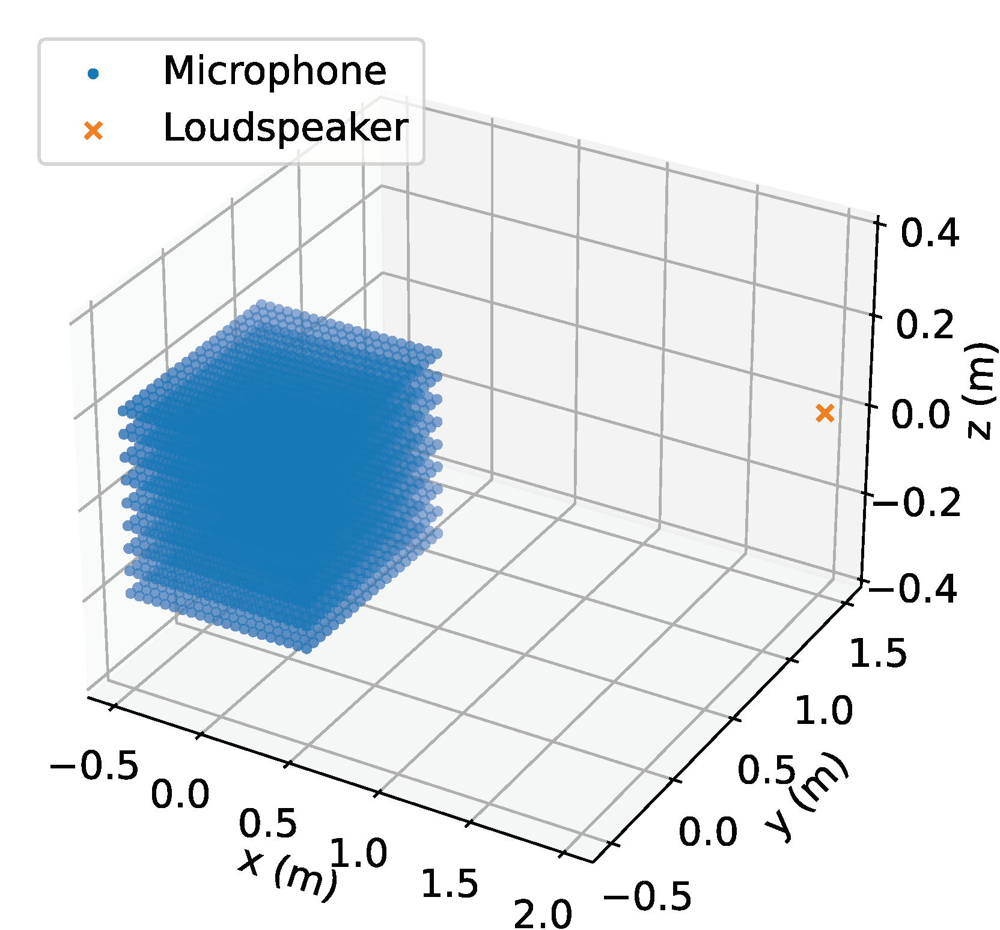
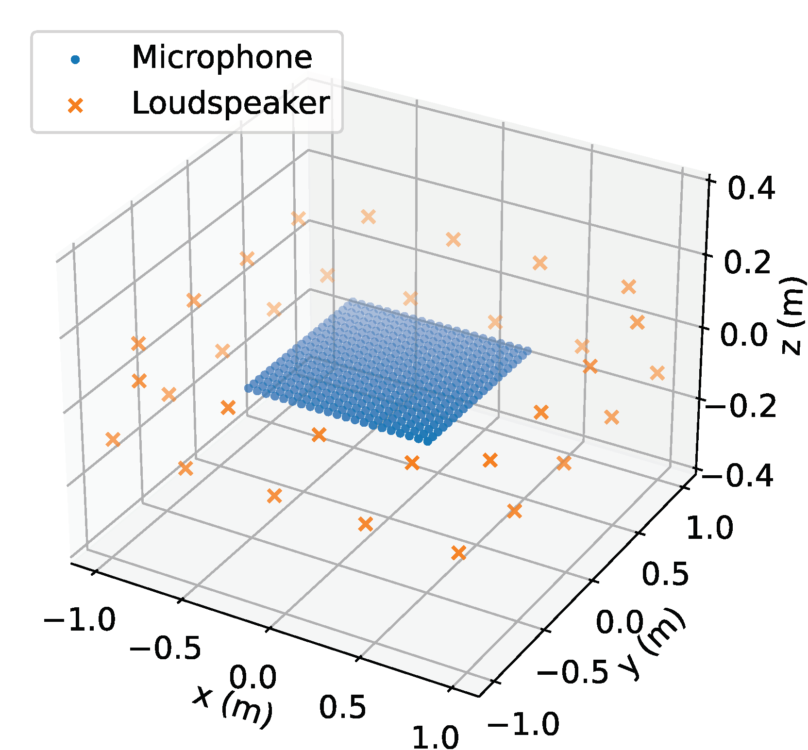
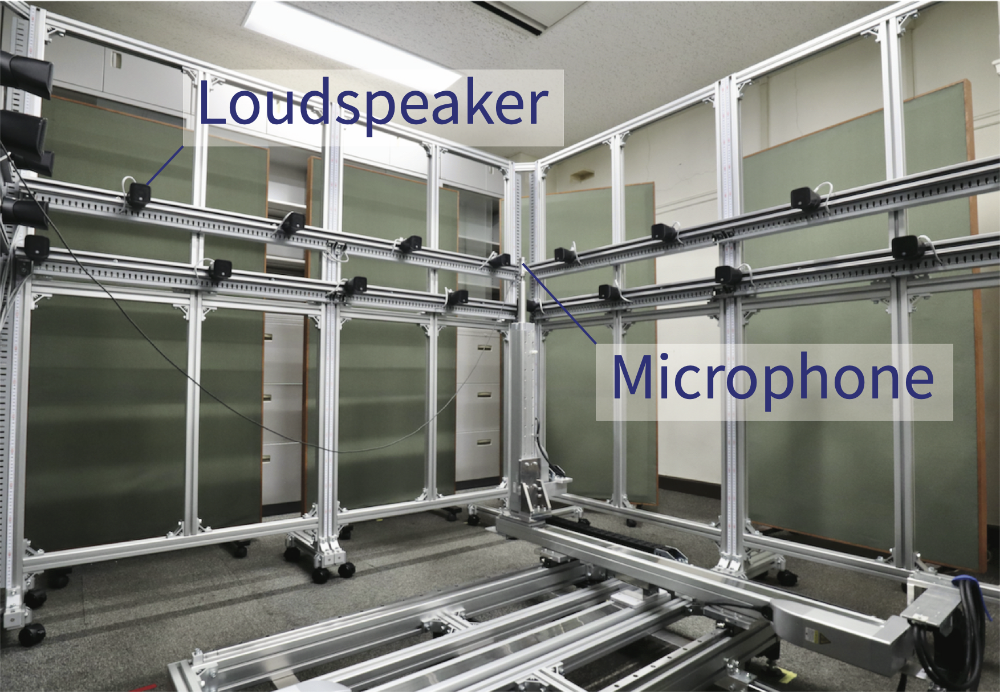

# About MeshRIR
MeshRIR is a dataset of acoustic room impulse responses (RIRs) on finely meshed grid points. Two sub-datasets are currently available: one is IRs in 3D cuboid region from a single source, and the other is IRs in 2D square region from array of 32 sources. This dataset is suitable for evaluating sound field analysis and synthesis methods.

# Download 
TBA

# Detailed description
The MeshRIR dataset consists of two sub-datasets. 
#### S1-M3969
- IRs inside 3D cuboid region from single source position

#### S32-M441
- IRs inside 2D square region from 32 source positions

<figure id="position" style="text-align:center">
 
<figcaption>Source and microphone positions of <strong>S1-M3969</strong> (left) and <strong>S32-M441</strong> (right)</figcaption>
</figure>

#### File format
The file format is `.npy` for Numpy and `.mat` for MATLAB. All the additional data is provided as a JSON file. 

#### Measurement conditions
IR at each position was measured by using a cartesian robot employed with an omnidirectional microphone (Primo, EM272J). The signal input and output were controlled by a PC with Dante interface. Loudspeaker was DIATONE, DS-7 for <strong>S1-M3989</strong> and YAMAHA, VXS1MLB <strong>S32-M441</strong>.

<table width="100%">
    <thead>
    <tr>
    <th width="30%"></th>
    <th width="35%" style="text-align:center">S1-M3969</th>
    <th width="35%" style="text-align:center">S32-M441</th>
    </tr>
    </thead>
    <tbody>
    <tr>
    <td>Sampling rate</td>
    <td style="text-align:center" colspan="2">48000 Hz</td>
    </tr>
    <tr>
    <td>IR length</td>
    <td style="text-align:center" colspan="2">32768 samples</td>
    </tr>
    <tr>
    <td>Room dimensions</td>
    <td style="text-align:center" colspan="2">7.0 m x 6.4 m x 2.7 m</td>
    </tr>
    <tr>
    <td>Number of sources</td>
    <td style="text-align:center">1</td>
    <td style="text-align:center">32</td>
    </tr>
    <tr>
    <td>Measurement region</td>
    <td style="text-align:center">1.0 m x 1.0 m x 0.4 m</td>
    <td style="text-align:center">1.0 m x 1.0 m </td>
    </tr>
    <tr>
    <td>Intervals of mics</td>
    <td style="text-align:center" colspan="2">0.05 m</td>
    </tr>
    <tr>
    <td>Number of mics</td>
    <td style="text-align:center">21 x 21 x 9 points</td>
    <td style="text-align:center">21 x 21 points </td>
    </tr>
    <tr>
    <td>RT60</td>
    <td style="text-align:center">0.38 s</td>
    <td style="text-align:center">0.19 s</td>
    </tr>
    <tr>
    <td>Avg. temperature</td>
    <td style="text-align:center">26.3 °C</td>
    <td style="text-align:center">17.1 °C</td>
    </tr>
    </tbody>
</table>

<figure id="position" style="text-align:center">
 
<figcaption>IR measurement system for <strong>S32-M441</strong></figcaption>
</figure>

# Usage
### Basic usage examples
See [ir_view.ipynb](https://github.com/sh01k/MeshRIR/blob/main/ir_view.ipynb) for the details.

- Import [irutilities.py](https://github.com/sh01k/MeshRIR/blob/main/irutilities.py)

~~~python
import irutilities as irutil
~~~

- Load microphone and source positions, and IR data

~~~python
posMic, posSrc, ir = irutil.loadIR(path_to_data_folder)
~~~

- Plot IR of source `srcIdx` and mic `micIdx`

~~~python
irutil.irPlots(ir[srcIdx, micIdx, :], samplerate)
~~~

### Application examples
- Sound field reconstruction: [examples/sf_reconst.ipynb](https://github.com/sh01k/MeshRIR/blob/main/example/sf_reconst.ipynb)
    - Estimation of pressure distribution by using the method proposed in [1].
    - Microphone positions are selected by the MSE-based sensor placement method [2].

- Sound field control: [examples/sf_control.ipynb](https://github.com/sh01k/MeshRIR/blob/main/example/sf_control.ipynb)
    - Synthesis of planewave field by pressure matching
    - Weighted mode-matching [3] is also demonstrated

# References
1. [N. Ueno, S. Koyama, and H. Saruwatari, “Sound field recording using distributed microphones based on harmonic analysis of infinite order,” IEEE SPL, 2018.](https://doi.org/10.1109/LSP.2017.2775242)
1. [T. Nishida, N. Ueno, S. Koyama, and H. Saruwatari, “Sensor placement in arbitrarily restricted region for field estimation based on Gaussian process,” in Proc. EUSIPCO, 2020.](https://doi.org/10.23919/Eusipco47968.2020.9287222)
1. [N. Ueno, S. Koyama, and H. Saruwatari, “Three-dimensional sound field reproduction based on weighted mode-matching method,” IEEE/ACM Trans. ASLP, 2019.](https://doi.org/10.1109/TASLP.2019.2934834)

# Author
- [Shoichi Koyama](https://www.sh01.org) (The University of Tokyo, Tokyo, Japan)
- Tomoya Nishida
- Keisuke Kimura
- Takumi Abe
- Natsuki Ueno
- Jesper Brunnström
 
